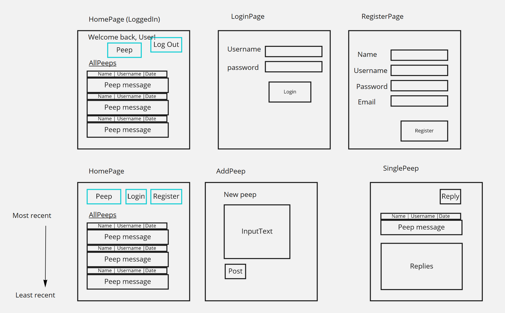

## Setup
---
1. Fork and clone this repo
2. Open your cloned repo on your local machine
3. Navigate to the /frontend folder and `npm i` to install required packages
4. Navigate to the /backend folder and `npm i` to install required packages

## Starting the App
---

1. In a new terminal, start your mongoDB with `mongod`
2. Navigate to /backend folder and in a new terminal type `npm start` to start the Node server
3. Navgiate to the /frontend folder and type `npm start` in a new terminal to start the React app

## Testing
---
Frontend
- In the /frontend folder, type `npm test` to run tests

Backend
- Ensure you're in the /backend folder
- Ensure your Node server isn't running (This is because the test environment uses the same host and port)
- Type `npm test` to run the integration tests

Postman
- You can also use Postman to test express routes

## Simple Wireframe
---

## Technologies used
---
Languages
- HTML
- CSS
- Javascript

Backend
- Mongoose
- MongoDB
- Cors
- Express
- Express Validator

Frontend
- Axios
- Dotenv
- React
- React Router v6
- React Bootstrap
- React Router Bootstrap

Testing
- Jest
- Mocha 
- Chai
- Chai Http
- React Testing Library

> See attached word document for a detailed plan